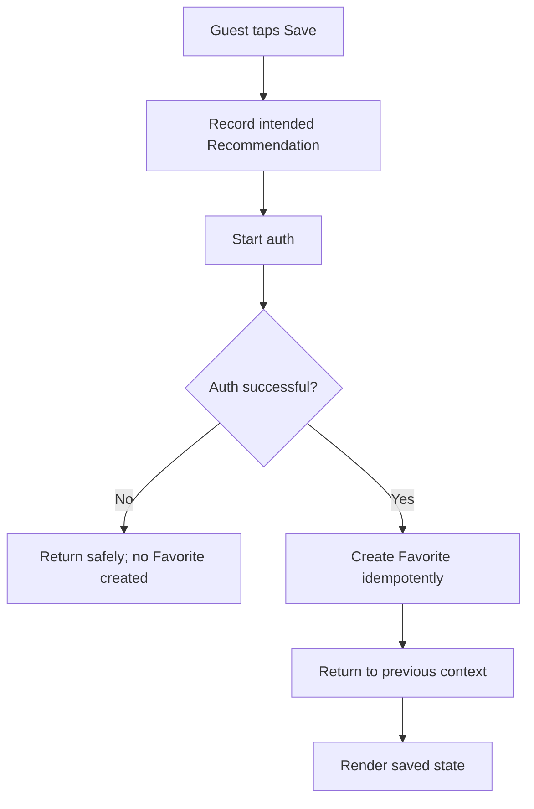
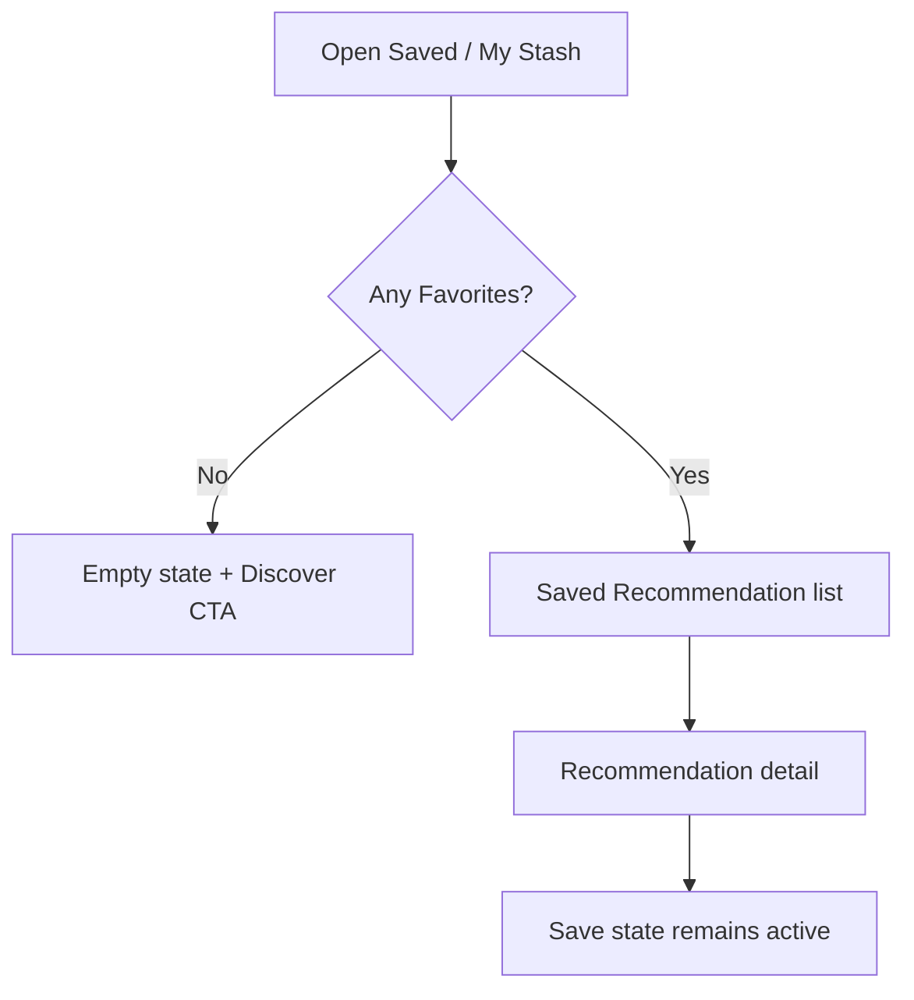
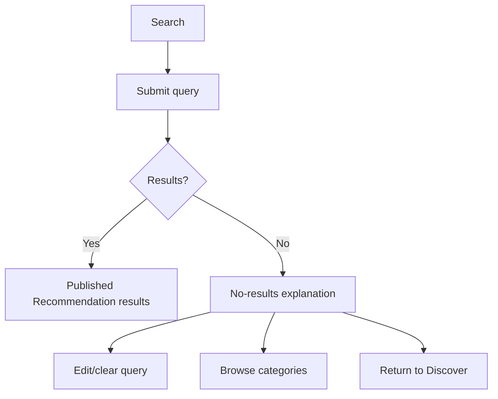
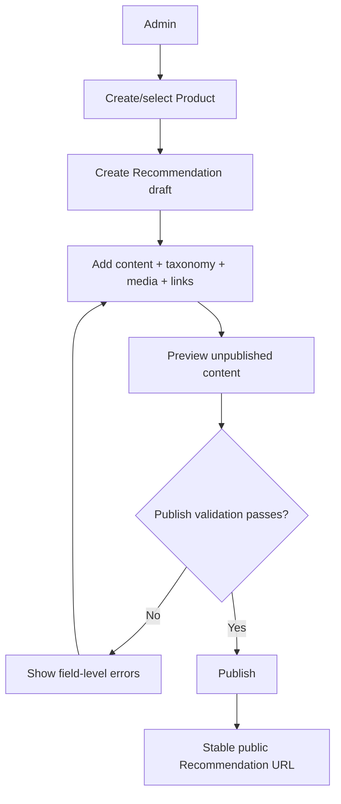
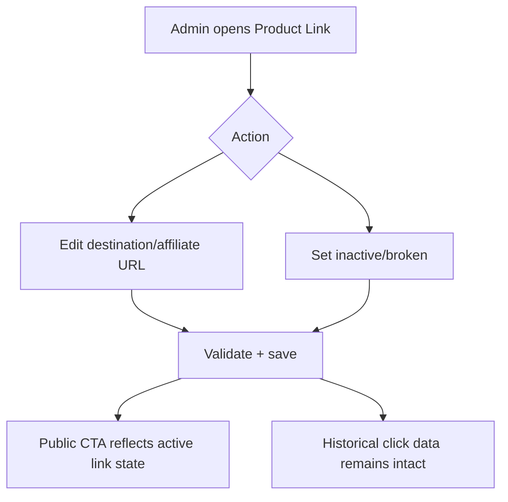

# 04 — Sitemap & User Flows

## Phase 1 sitemap

```text
/
├─ /discover
│  └─ /category/[slug]            # exact route can be refined
├─ /search
├─ /r/[slug]                      # Recommendation detail
├─ /saved                         # auth required
├─ /account                       # auth required
├─ /auth/...                      # provider-specific implementation
├─ /go/[code]                     # track + external redirect
└─ /admin                         # ADMIN only
   ├─ /products
   │  ├─ /new
   │  └─ /[id]
   ├─ /recommendations
   │  ├─ /new
   │  └─ /[id]
   ├─ /brands
   ├─ /categories
   ├─ /tags
   ├─ /marketplaces
   ├─ /media
   └─ /analytics
```

Public route spelling may be refined during implementation, but routes must retain the behaviours in the PRD.

## Navigation

### Mobile consumer
Bottom navigation:
- Home
- Discover
- Search
- Saved
- Me

### Desktop consumer
Persistent top/global navigation:
- Home
- Discover
- Search
- Saved/account actions

### Admin
Persistent operational navigation:
- Dashboard
- Products
- Recommendations
- Taxonomy
- Marketplaces/Links
- Media
- Analytics

## F-01 — Guest discovery → recommendation → external store

```mermaid
flowchart TD
    A[Home / Discover / Category] --> B[Recommendation card]
    B --> C[Recommendation detail]
    C --> D{Active marketplace link?}
    D -- No --> E[Content remains readable; purchase CTA unavailable]
    D -- Yes --> F[/go/code]
    F --> G[Validate link]
    G --> H[Record outbound click]
    H --> I[Redirect to marketplace]
```

Rules:
- no auth required for discovery/detail/outbound click
- only `PUBLISHED` Recommendations appear publicly
- dead links must not cause arbitrary redirect

## F-02 — Guest save → auth → automatic Favorite



The intended Favorite must be created **exactly once**.

## F-03 — Registered user → My Stash → recommendation



## F-04 — Search → no results → recovery



Do not fill a no-result state with unrelated fake matches.

## F-05 — Admin create → preview → publish



## F-06 — Admin replace/disable marketplace link



## State preservation rules

- back navigation from Recommendation detail should preserve useful feed/search state
- Search query persists through result/detail navigation
- guest Save intent persists through authentication
- authentication redirect targets must be validated/safe
- Favorites reflect server truth after mutation
- inactive Product Links disappear from eligible public CTAs without deleting historical analytics

## Required system states

Every P0 surface must account for:
- loading
- empty
- network error
- unavailable/archived content
- authentication required
- no active marketplace link
- mobile and desktop responsive behaviour

## Wireframe/UI priority

### P0 consumer
1. Home
2. Discover
3. Search
4. Recommendation Detail
5. Auth continuation
6. My Stash/Favorites

### P0 Admin
1. Dashboard
2. Recommendation list
3. Recommendation editor
4. Product management
5. Taxonomy management
6. Product Link management
7. Analytics
