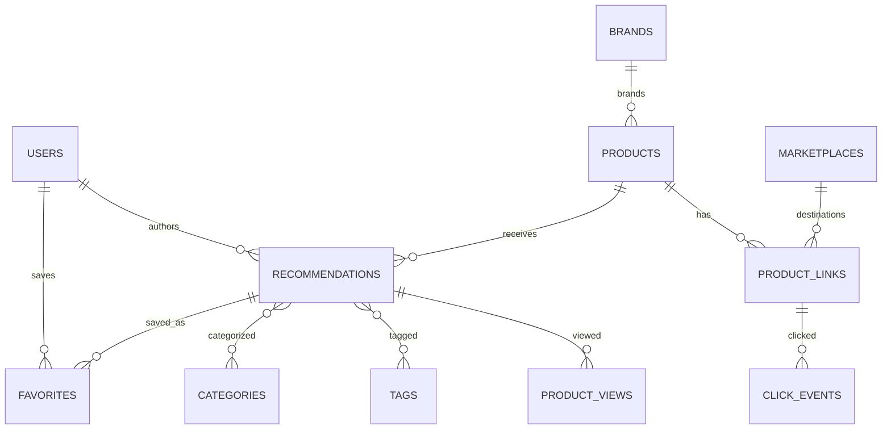

# 06 — Technical Architecture & Database Schema

## Architecture summary

Phase 1 should be implemented as a **modular monolith**.

Recommended baseline:

- Next.js App Router
- React
- TypeScript strict mode
- Tailwind CSS
- shadcn/ui-ready component architecture
- PostgreSQL
- Drizzle ORM
- Better Auth integration boundary
- Zod validation
- S3-compatible object storage
- Vitest
- Playwright or equivalent for critical E2E paths
- Vercel or compatible web runtime

Avoid premature microservices.

## Architecture principles

- domain boundaries are explicit even inside one repo
- Product and Recommendation remain separate
- server-side authorization is authoritative
- public reads are cacheable where appropriate
- authenticated/Admin writes are dynamic and validated
- core business events are stored internally
- production media is never stored on local filesystem
- external redirects are validated and measurable
- Phase 2 extensibility must not create Phase 2 implementation work now

## Suggested modules

```text
src/
├─ app/
│  ├─ (public)/
│  ├─ (account)/
│  ├─ admin/
│  ├─ api/
│  └─ go/[code]/
├─ modules/
│  ├─ auth/
│  ├─ users/
│  ├─ products/
│  ├─ recommendations/
│  ├─ taxonomy/
│  ├─ marketplaces/
│  ├─ favorites/
│  ├─ media/
│  ├─ search/
│  └─ analytics/
├─ db/
│  ├─ schema/
│  ├─ migrations/
│  └─ seeds/
├─ components/
├─ lib/
└─ config/
```

Exact folder names may change, but business logic must not collapse into route files/components.

## Logical model



## Core schema v0.1

### `users`

Proposed:

- `id uuid PK`
- `auth_user_id text UNIQUE FK -> auth_users.id`
- `name text`
- `avatar_url text nullable`
- `role enum(USER, ADMIN)`
- `status enum(ACTIVE, SUSPENDED)`
- timestamps

Auth library may own provider/account/session/verification tables.

### `brands`

- `id uuid PK`
- `name varchar(160)`
- `slug varchar(180) UNIQUE`
- `website_url nullable`
- status
- timestamps

### `products`

- `id uuid PK`
- `brand_id nullable FK`
- `name varchar(220)`
- `slug varchar(240) UNIQUE`
- `short_description nullable`
- `status enum(DRAFT, ACTIVE, ARCHIVED)`
- timestamps

Products are canonical records. Marketplace-specific identifiers and external destination URLs belong to Product Links, not Products.

Product has no cart/order/payment fields.

### `recommendations`

- `id uuid PK`
- `product_id FK`
- `author_user_id FK -> users.id`
- `slug varchar(240) UNIQUE`
- `headline varchar(220)`
- `summary text`
- `body_json jsonb`
- `why_recommended nullable`
- `pros_json nullable`
- `cons_json nullable`
- `best_for nullable`
- `status enum(DRAFT, PUBLISHED, ARCHIVED)`
- `featured boolean`
- `published_at timestamptz nullable`
- timestamps

### `categories`

- `id uuid PK`
- `name`
- `slug UNIQUE`
- `description nullable`
- `sort_order`
- `status`

### `recommendation_categories`

Composite key:

- `recommendation_id`
- `category_id`

### `tags`

- `id uuid PK`
- `name`
- `slug UNIQUE`

### `recommendation_tags`

Composite key:

- `recommendation_id`
- `tag_id`

### `marketplaces`

- `id uuid PK`
- `name`
- `slug UNIQUE`
- `icon_url nullable`
- `status`
- `sort_order`

### `product_links`

- `id uuid PK`
- `product_id FK`
- `marketplace_id FK`
- `label nullable`
- `destination_url text`
- `affiliate_url text nullable`
- `redirect_code varchar(32) UNIQUE`
- `display_price numeric(12,2) nullable`
- `currency char(3) nullable`
- `is_primary boolean`
- `status enum(ACTIVE, INACTIVE, BROKEN)`
- `last_checked_at nullable`
- timestamps

### `favorites`

- `id uuid PK`
- `user_id FK`
- `recommendation_id FK`
- `created_at`
- `UNIQUE(user_id, recommendation_id)`

Favorite targets Recommendation, not Product.

### `media_assets`

Proposed Phase 1 shape:

- `id uuid PK`
- `owner_type enum(PRODUCT, RECOMMENDATION)`
- `owner_id uuid`
- `storage_key`
- `public_url nullable`
- `mime_type`
- `kind enum(IMAGE, VIDEO)`
- `width/height nullable`
- `duration_ms nullable`
- `alt_text nullable`
- `sort_order`
- `status`

If polymorphic ownership becomes awkward in Drizzle/PostgreSQL integrity, normalising join tables is acceptable. Preserve the domain behaviour.

### Analytics tables

`product_views`

- recommendation_id
- optional user/anonymous/session context
- referrer
- occurred_at
- metadata

`click_events`

- product_link_id
- optional recommendation_id
- optional user/anonymous/session context
- referrer
- occurred_at
- metadata

`search_events`

- query
- result_count
- optional user/anonymous context
- occurred_at

## Data integrity rules

- public slugs are unique
- Favorites are unique by `(user_id, recommendation_id)`
- only `ACTIVE` Product Links resolve through `/go/[code]`
- only `PUBLISHED` Recommendations appear publicly
- published recommendation normally requires Product, headline, summary, valid media and active link
- destructive deletion is avoided when it would erase analytics/history
- indexes should support:
  - public slug lookup
  - published listing/order
  - category joins
  - favorite lookup
  - redirect code lookup
  - analytics time/content aggregation
  - search

## Auth and RBAC

The launch provider mix is open (`AUTH-01`).

Architecture requirements:

- Better Auth (or agreed auth layer) can manage identity/session/provider tables
- application `users` profile carries business role/status and maps one-to-one to Better Auth through unique `auth_user_id`
- auth provider identity remains provider-agnostic; app profiles must not duplicate auth identity by email alone
- Admin authorization is checked server-side
- hiding an Admin button is never considered authorization
- suspended users cannot perform protected actions
- auth implementation must remain replaceable until provider decision closes

## Search

Phase 1 search remains in PostgreSQL.

Baseline:

- indexed published Recommendation/Product text
- title/brand exact-match weighting
- full-text search
- `pg_trgm` if typo tolerance is needed
- migrate to external search only after actual scale/relevance need

Public search must never leak drafts.

## Redirect architecture

`GET /go/[code]`

1. resolve code
2. load Product Link
3. require valid status
4. choose `affiliate_url ?? destination_url`
5. validate destination policy
6. record click event
7. redirect with appropriate HTTP response

Security:

- never accept arbitrary target URL from query string and redirect blindly
- prevent open redirect behaviour
- do not log secret/credential URL data
- handle bots/prefetch separately where feasible
- historical click attribution remains after link is disabled

## Media

Preferred flow:

1. Admin requests upload intent
2. server validates metadata and permission
3. upload to S3-compatible storage using signed URL or controlled upload endpoint
4. record metadata only after successful upload
5. derive optimised variants as needed
6. serve public assets through stable CDN/object URL or image optimisation layer

Store alt text and dimensions.

## Analytics event taxonomy

Canonical events:

- `recommendation_view`
- `favorite_attempt`
- `favorite_saved`
- `favorite_removed`
- `outbound_click`
- `search_submitted`
- `category_view`
- `auth_started`
- `auth_completed`

Example outbound CTR baseline:

> qualified `outbound_click` ÷ eligible `recommendation_view`

Exclude known bots/prefetch where feasible.

## API / command boundaries

Representative contracts:

| Contract                                       | Access | Purpose                          |
| ---------------------------------------------- | ------ | -------------------------------- |
| `GET /api/search`                              | Public | Search published Recommendations |
| `POST /api/favorites`                          | User   | Idempotent Save                  |
| `DELETE /api/favorites/[recommendationId]`     | User   | Unsave                           |
| `GET /go/[code]`                               | Public | Track + redirect                 |
| `POST /api/admin/recommendations`              | Admin  | Create draft                     |
| `PATCH /api/admin/recommendations/[id]`        | Admin  | Update                           |
| `POST /api/admin/recommendations/[id]/publish` | Admin  | Validate + publish               |
| `POST /api/admin/media/upload-intent`          | Admin  | Upload intent                    |
| `PATCH /api/admin/product-links/[id]`          | Admin  | Edit/disable link                |
| `GET /api/admin/analytics/summary`             | Admin  | Dashboard aggregates             |

Next.js Server Actions may be used for same-origin form commands. Domain services/validation should remain reusable so future mobile clients are possible.

## SEO/rendering

### Recommendation detail

- server-render metadata
- canonical URL
- Open Graph metadata/image
- structured data only when semantically accurate

### Home/Discover/Category

- cache/revalidate read-heavy sections
- invalidate after relevant publish/archive/feature changes

### Favorites/Account/Admin

- dynamic authenticated rendering
- no public indexing

### Search

- dynamic
- generally noindex query result pages for Phase 1

### Sitemap

Generate from published Recommendation/category URLs.

## Security baseline

- strict input validation
- RBAC on server
- CSRF protections appropriate to auth/action approach
- secure session cookies
- safe redirect allow/validation model
- rate-limit sensitive endpoints
- do not expose raw SQL/provider errors to users
- no secrets in logs
- validate uploads by type/size
- least-privilege storage credentials
- audit important Admin operations where practical

## Environments

At minimum:

- Local
- Preview / branch deployment
- Staging or equivalent non-prod integration environment
- Production

Secrets/config must be environment-specific.

## Open technical decisions

- `AUTH-01` launch authentication provider mix
- `BRAND-01` final public name
- package manager choice — choose once and commit one lockfile
- error monitoring provider before staging UAT
- rate-limit implementation before redirect/auth launch
- exact managed PostgreSQL and object-storage providers if not yet selected
